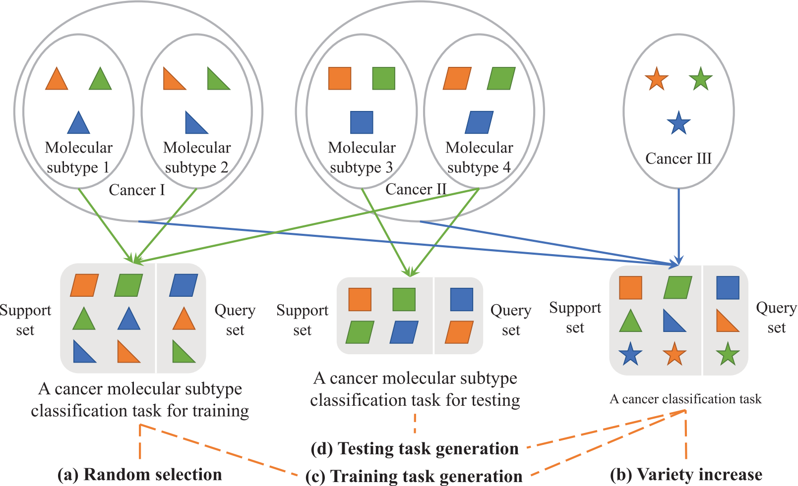
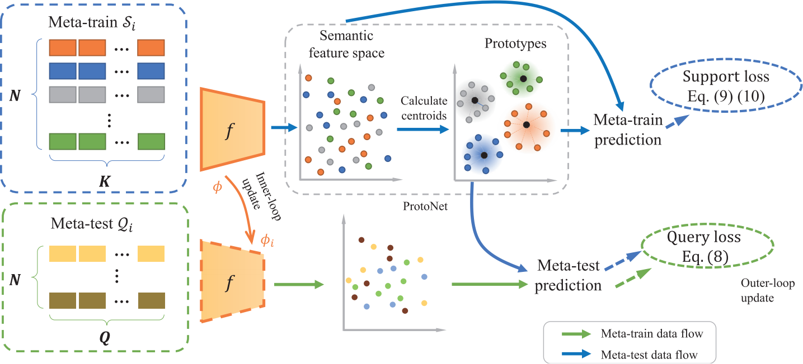

# TSEML

**TSEML: A task-specific embedding-based method for few-shot classification of cancer molecular subtypes** submitted to BIBM 2024
by [Ran Su](https://ransu-lab.netlify.app/), [Hui Cui](https://scholars.latrobe.edu.au/display/lcui), [Qiangguo Jin](https://scholar.google.com/citations?user=USoKG48AAAAJ),  et al.

### Example results 

- Figure 1:  Overview of (a) Random selection, (b) Variety increase, (c) Training task generation, and (d) Testing task generation.

- Figure 2: The training paradigm of the proposed TSEML. TSEML leverages the nearest feature centroid approach of ProtoNet and the gradient update inner loop of MAML to enable the model to perform task-specific embeddings for samples.

- Figure 3:  Visual interpretation of high-level embeddings learned by different methods on TCGA Few-Shot. The red, blue, and green arrows highlight the ability of our TSEML to discriminate specific subtypes.

### Dataset
Due to the scarcity of few-shot learning datasets for molecular subtyping, we create anew TCGA Few-Shot dataset, derived from the TCGA datasets.

## Social media

 
Welcome to follow our [Wechat official account: iBioMedInfo] and [Xiaohongshu official account: iBioMedInfo], we will share recent studies on biomedical image and bioinformation analysis there.

### Global Collaboration & Questions

**Global Collaboration:** We're on a mission to biomedical research, aiming for artificial intelligence and its applications to biomedical image and bioinformation analysis, promoting the development of the medical community. Collaborate with us to increase competitiveness.

**Questions:** General questions, please contact 'qgking@tju.edu.cn'
